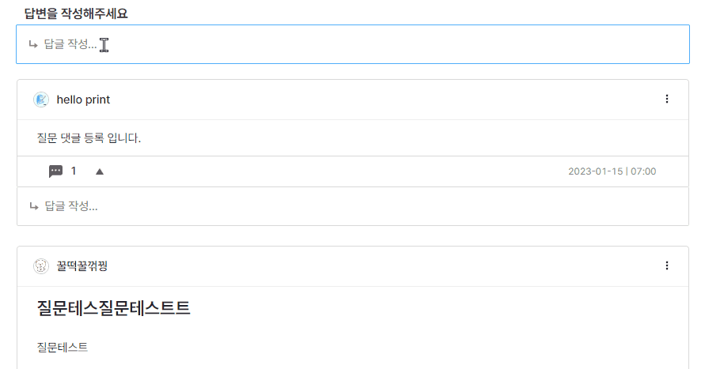

# dobda

리워드 지급이 가능한 개발자 전용 Q&A 와 간단한 외주를 등록할 수 있는 커뮤니티.

## 배포 링크

https://dobda.io

## 기능 소개

### 소셜 로그인 ``Google, github, naver``

### 질문 하기(wysiwyg editor)

* [ ] 질문 등록시 리워드 금액 등록
* [ ] 댓글/대댓글 등록 기능

- [X] 답변에 대한 채택 기능
- [ ] 채택된 답변 유저에게 질문에 달린 리워드 지급
- [ ] 질문등록시 유저 보유 잔고에서 리워드 금액만큼 차감되어 특정 테이블(DB)에서 임시로 보관함.
- [X] 임시보관 테이블에서 채택된 유저에게 지급되거나, 질문 유저에게 지급

### 소싱 등록

- 질문 하기 기능 +
- 소싱 프로세스
  - 소싱 등록 => 작업할 유저 선택 => 프로젝트 시작 => 제출 => 작업 금액 지금 승인 요청 & 지급
  - 소싱 등록시 작업 금

### 포트폴리오

- WYSIWYG에디터로 자유로운 작성가능한 나만의 포트폴리오 기능
